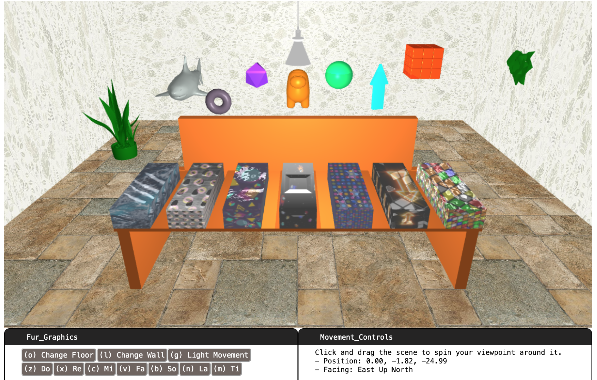

# Für Graphics

Our project is to have an animated piano-like interface where users can press keys on their keyboards to make visual changes pop up depending on which keys they press.

### Code Location

The main inplementation of the project is located in `./fur_graphics.js`. 

### User Interaction

We also included a set of user interactions through key press. Users can either press on one of the piano keys for the background objecto to animate, or one of the setting keys to change the environment of the room. There are 3 different floor options and 3 wall options. 

### Key Press
The project simulate keyboard key press as actual piano keys. When a user press down on the key, the corresponding piano key gets pressed, and animation starts. When a user release the key, the piano key is realsed, and animation stops. 

### Full List of Features
- translations, rotations, scaling
- color change
- defined animations
- importing object files
- implemented bump texture*
- shadow/lighting*

### References

https://github.com/Robert-Lu/tiny-graphics-shadow_demo

https://www.turbosquid.com